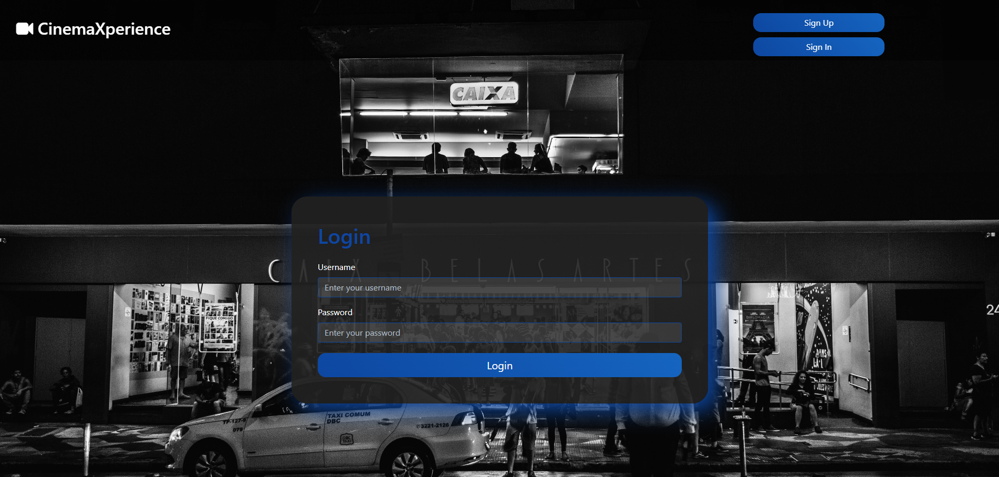
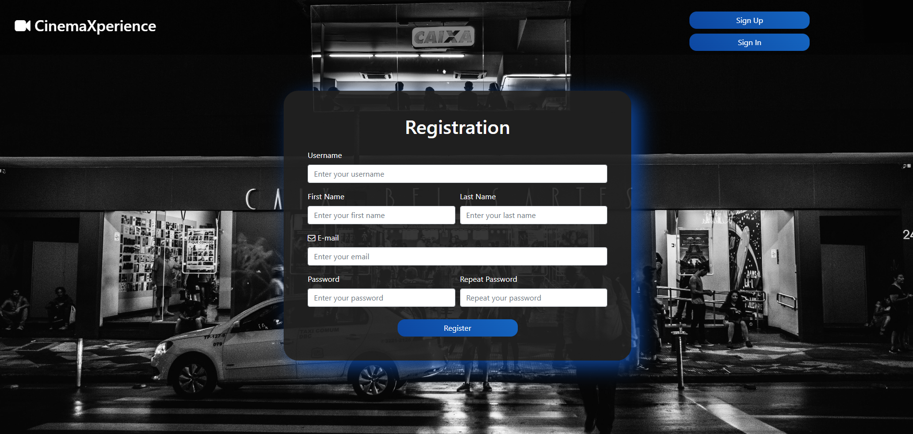
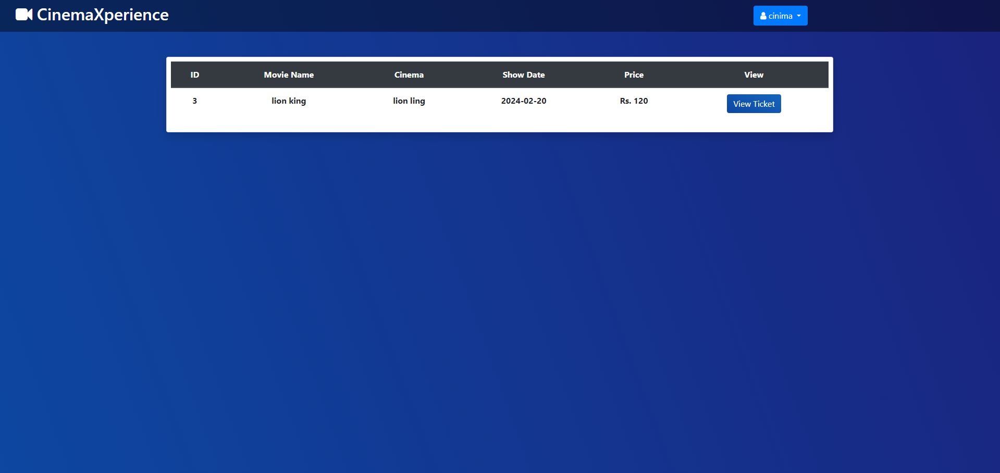
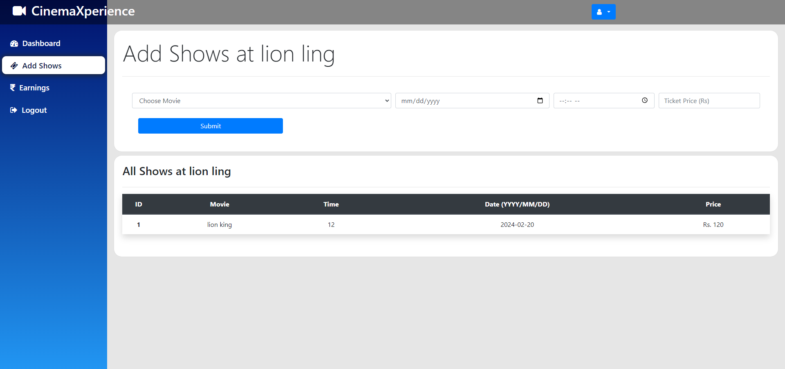

# CinemaXperience

CinemaXperience is a Django-based web application that aims to provide an enhanced cinema experience by allowing users to browse movies, book tickets, and manage their profiles. The application is designed with a user-friendly interface and includes both user and admin modules.

## Features

- **User Module**
  - Browse a catalog of movies.
  - Secure user registration and authentication.
  - Intuitive ticket booking system with real-time seat selection.
  - User profiles for personalized experiences.
  - Earnings page to view the user's booking history and expenses.

- **Admin Module**
  - Admin panel for managing movies, users, bookings, and shows.
  - Add new movies and shows to the catalog.
  - View earnings and booking statistics.

## Screenshots

### 1. Index

*Description: The landing page showcasing featured movies and a responsive carousel.*

### 2. Login

*Description: The login page where users can securely log in to their accounts.*

### 3. Register

*Description: User registration page with fields for creating a new account.*

### 4. Profile

*Description: User profile page displaying personalized information and settings.*

### 5. Earnings

*Description: Earnings page for users, showing booking history and expenses.*

### 6. Booking

*Description: Booking page with a seat selection feature for a seamless ticket reservation process.*

### 7. Add Show

*Description: Admin module page for adding new shows to the movie catalog.*

## Getting Started

1. Clone the repository.
2. Create a virtual environment and install dependencies using `pip install -r requirements.txt`.
3. Apply migrations with `python manage.py migrate`.
4. Run the development server with `python manage.py runserver`.

Visit our [live demo](#) to experience CinemaXperience firsthand!
